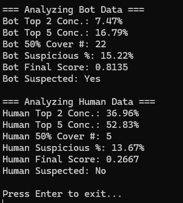
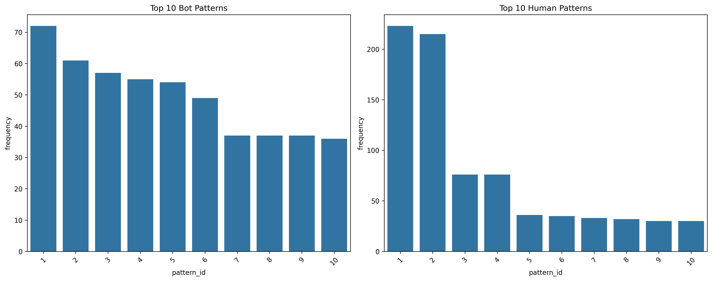
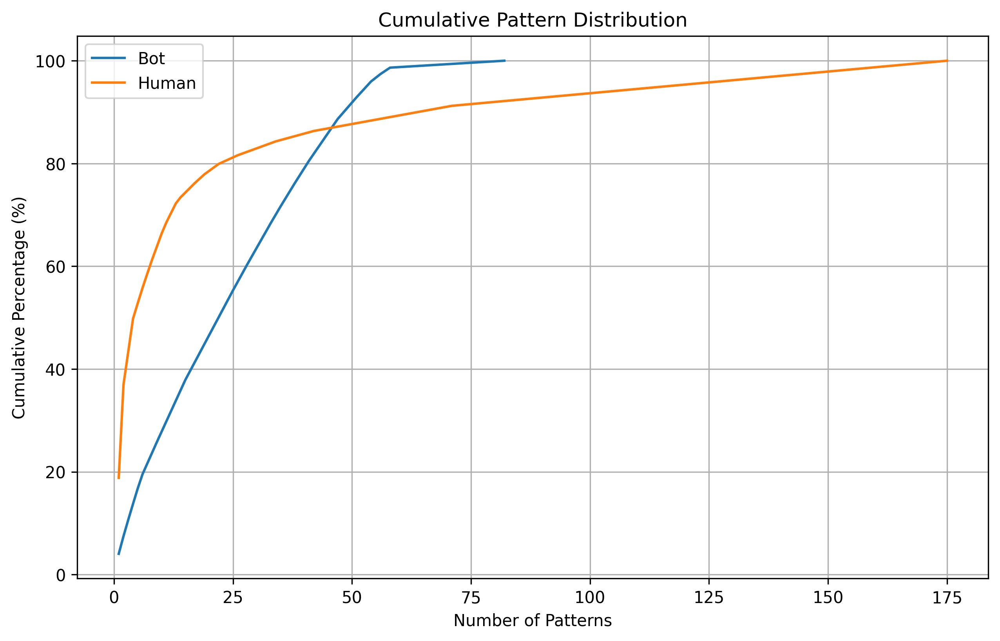
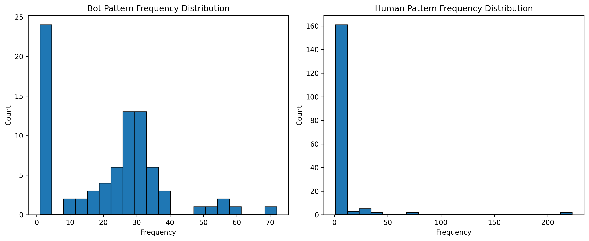

# MapleStory Bot Detection via Keyboard Input Pattern Analysis

## 프로젝트 소개 (Introduction)

본 프로젝트는 게임 내 자동 사냥 봇(Bot)을 탐지하기 위한 시스템 프로토타입입니다. 특히, 최근 봇들이 탐지를 회피하기 위해 사용하는 **저수준 키보드 입력(Key Down/Up)의 랜덤화(Randomization) 기법**에 대응하는 것을 목표로 합니다. 사용자의 키 입력 패턴을 분석하여 사람 플레이어와 봇을 구분하는 통계적 방법을 연구하고 C++로 구현합니다.

이 프로젝트는 직무 지원을 위한 포트폴리오 목적으로 진행되었으며, ServerSide-AntiCheat 기술에 대한 이해와 C++ 프로그래밍 역량, 문제 해결 능력을 보여주고자 합니다.

## 프로젝트 구조

```cpp
KeyboardMacroDetector/
├── include/
│   ├── InputEvent.h      // 이벤트 타입 및 구조체 정의
│   ├── PatternAnalyzer.h // 패턴 분석 클래스 선언
│   └── Constants.h       // 상수 및 설정값 정의
├── src/
│   ├── PatternAnalyzer.cpp // 패턴 분석 구현
│   └── main.cpp           // 메인 실행 파일
└── python/
    └── visualizer.py      // 데이터 시각화 스크립트
```

## 주요 기능 (Features)

- **키보드 로깅:** RawInput Windows Hook(WH_KEYBOARD_LL)을 사용하여 사용자의 키보드 입력(Key Down/Up) 이벤트와 정밀한 타임스탬프를 CSV 파일로 기록합니다.
- **데이터 파싱:** 로깅된 CSV 파일을 파싱하여 C++ 프로그램에서 처리할 수 있는 `InputEvent` 구조체 벡터로 변환합니다.
- **마이크로 패턴 분석:** 특정 게임 액션(예: 더블 점프 후 공격)과 관련된 핵심 키들의 짧은 Key Down/Up 시퀀스("마이크로 패턴")를 추출하고, 각 패턴의 빈도수를 계산합니다.
- **특징 추출 (Feature Extraction):** 분석된 패턴 빈도수 분포로부터 다음과 같은 통계적 특징(Feature)을 추출합니다.
  - **상위 패턴 집중도 (Top Pattern Concentration):** 상위 N개 패턴이 전체에서 차지하는 비율 (봇은 낮을 것으로 예상).
  - **분포 균일성/평탄도 (Distribution Flatness):** 전체의 특정 비율을 커버하는데 필요한 패턴 수 (봇은 많을 것으로 예상).
  - **봇 특화 패턴 점수 (Bot-Specific Pattern Score):** 사전에 정의된 '봇 의심 패턴'이 차지하는 비율 (봇은 높을 것으로 예상).
- **봇 탐지 로직:** 추출된 특징들을 **가중치 기반으로 결합**하여 최종 '봇 의심 점수'를 계산하고, 임계값을 기준으로 봇 의심 여부를 판정합니다.

## 동작 원리 / 방법론 (How it Works / Methodology)

1.  **데이터 수집 (Data Acquisition):**

    - **정상 데이터 (Human Data):** 구현된 C++ 키로거(`KeyboardLogger`)를 사용하여 실제 사용자가 사냥을 하는 키 입력 데이터를 `Timestamp(ms),EventTypeString,KeyCode` 형식의 CSV 파일로 수집합니다.
    - **비정상 데이터 (Bot Data):** 게임 내 자동 사냥 로직(특히, 저수준 입력 랜덤화 기법 포함)을 시뮬레이션하고, 해당 스크립트가 _의도한_ 키 입력을 **동일한 CSV 형식**으로 로깅하여 생성합니다. (_본 프로젝트에서는 특정 더블 점프 랜덤화 로직을 사용하는 봇을 가정했습니다._)

2.  **데이터 파싱 (Data Parsing):**

    - C++ 분석 프로그램에서 CSV 로그 파일을 읽어 각 라인을 `InputEvent` 구조체(`std::chrono::time_point`, `EventType`, `KeyCode`)로 변환하여 `std::vector<InputEvent>`에 저장합니다. (`parseLogFile` 함수)

3.  **마이크로 패턴 분석 (Micro-Pattern Analysis):**

    - 특정 핵심 행동(예: 더블 점프 후 공격)에 관련된 키 코드 집합(예: `VK_ALT`, `VK_C`, `VK_A`)을 정의합니다.
    - 파싱된 이벤트 벡터를 순회하며, 핵심 키가 포함된 짧은 시퀀스(예: 길이 6~8개, 특정 시간 300ms내)를 '마이크로 패턴'으로 추출합니다. (`calculateMicroPatternFrequencies` 함수 내 로직)
    - 추출된 각 마이크로 패턴(`std::vector<std::pair<EventType, unsigned int>>`)을 식별자로 사용하여, `std::map<MicroPattern, int>` 형태의 빈도수 맵에 각 패턴의 등장 횟수를 기록합니다.

4.  **특징 추출 (Feature Extraction):**

    - 계산된 빈도수 맵과 전체 인스턴스 수를 바탕으로 다음 특징들을 계산합니다.
      - `calculateTopNConcentration()`: 상위 N개 패턴 점유율(%) 계산.
      - `calculateCoveragePatternCount()`: 특정 비율(예: 50%) 커버리지에 필요한 패턴 수 계산.
      - `calculateSuspiciousPatternScore()`: 사전에 정의된 `std::set<MicroPattern>`에 포함된 패턴들의 점유율(%) 계산.  
        (본 프로젝트는 비교군이 적어 Human Pattern내 Count가 2 이하인 Patten들로 정의했으나 오탐을 막기 위해 추후 FineTuning 필요)

5.  **탐지 로직 (Detection Logic):**
    - `calculateBotSuspicionScore()`: 위에서 계산된 특징 값들을 입력받아, 각각을 0~1 범위의 '의심도 점수'로 정규화합니다.  
      (낮은 집중도, 높은 커버리지 수, 높은 의심 패턴 점수가 높은 의심도 점수를 가짐)
    - 각 의심도 점수에 미리 정의된 가중치(Weights)를 곱하여 합산함으로써 최종 점수를 계산합니다.
    - `isBotSuspected()`: 최종 점수가 설정된 임계값(Threshold)을 초과하는지 여부로 봇 의심 판정을 내립니다.
    - **중요:** 특징 점수화 방식, 가중치, 임계값은 실제 데이터 분석을 통해 추후 **튜닝**되어야 합니다.

## 분석 결과 시각화

프로젝트는 세 가지 주요 시각화를 제공합니다:

1. Top 10 패턴 비교 - 가장 빈번한 패턴들의 분포를 보여줍니다.
2. 누적 분포 그래프 - 전체 패턴의 집중도를 시각화합니다.
3. 박스플롯 비교 - 봇과 사람의 패턴 빈도 분포를 통계적으로 비교합니다.
     
   
   
   

## 분석 결과 (Results / Analysis)

10분간의 봇 플레이 데이터(4836 이벤트)와 사람 플레이 데이터(5026 이벤트)를 분석한 결과, 다음과 같은 마이크로 패턴(길이 6~8, LALT Down 시작) 빈도 분포에서 명확한 차이가 발견되었습니다.

**봇 데이터:**

- 총 패턴 인스턴스: 1781
- 고유 패턴 수: 82
- 상위 1위 패턴 점유율: ~4.04%
- 상위 2개 패턴 점유율 합계: ~7.47%
- 상위 5개 패턴 점유율 합계: ~17.09%
- **특징:** 특정 패턴의 압도적 우위 없이, 상위권 패턴들의 빈도가 비교적 고르게 분포함 (Flatter distribution). 이는 저수준 실행 방식 랜덤화의 결과로 보임.

**사람 데이터:**

- 총 패턴 인스턴스: 1185
- 고유 패턴 수: 175
- 상위 1위 패턴 점유율: ~18.82%
- 상위 2개 패턴 점유율 합계: **~36.96%**
- 상위 5개 패턴 점유율 합계: **~51.62%**
- **특징:** 상위 2개의 특정 패턴이 전체의 1/3 이상을 차지할 정도로 매우 우세함 (Highly peaked distribution). 이는 사람이 선호하는 주력 패턴(손에 익은 패턴)이 있음을 시사함. 또한, 봇보다 훨씬 많은 종류의 고유 패턴(특히 빈도수 1인 패턴)이 발견되어 자연스러운 변동성을 보여줌.

이러한 결과는 **패턴 빈도 분포의 집중도 및 형태 분석**이 키 입력 패턴 랜덤화 기반 봇을 탐지하는 데 유효한 접근 방식이 될 수 있음을 강력하게 뒷받침합니다.

## 한계점 및 향후 개선 방향

### 현재 한계점

- **데이터셋:** 현재 분석은 단일 사용자의 플레이 데이터와 특정 로직의 봇 데이터에 기반하므로, 일반화하기에는 한계가 있습니다. 더 많은 사용자 및 다양한 봇 데이터가 필요합니다.
- **탐지 로직 우회:** 현재 구현된 특징 기반 탐지 로직은 봇 제작자가 **가중치 랜덤화** 등을 통해 다시 우회할 수 있습니다. (예: 특정 패턴 빈도를 인위적으로 높여 사람처럼 보이게 조작)
- **튜닝 의존성:** 탐지에 사용되는 임계값과 가중치는 데이터에 기반한 세심한 튜닝이 필수적입니다.

### 향후 개선 방향

- **탐지 로직 고도화:**
  - 주력 패턴의 **미세 타이밍 분산 분석** 추가.
  - 입력 패턴 주변의 **'노이즈' 레벨 분석** 추가.
  - 다양한 특징들을 종합하는 **머신러닝 모델(ML)** 도입 검토.
- **데이터 확장:** 다양한 사용자, 다양한 플레이 스타일, 다양한 종류의 봇 데이터를 확보하여 모델의 일반화 성능 향상.
- **실시간 분석:** 현재는 로그 파일 기반의 후처리 분석이지만, 실시간 스트림 분석으로 확장 가능성 검토.
- **게임 상태 연동:** 게임 클라이언트/서버의 상태 정보와 키 입력을 연동하여 더욱 정확한 컨텍스트 기반 분석 수행.

## 라이선스 (License)

MIT License
